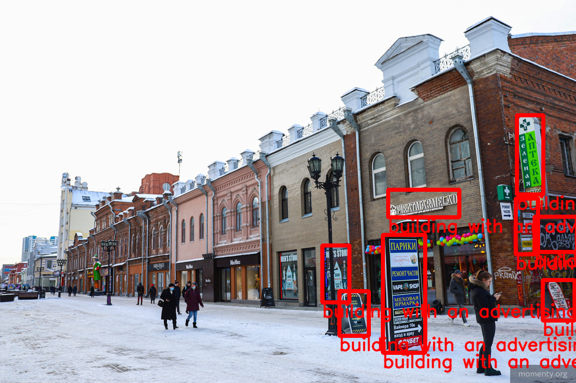
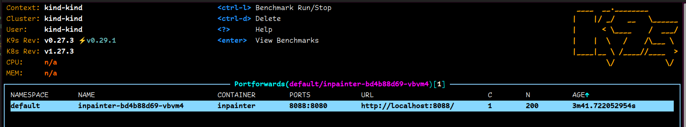

# Capstone project 01
## Problem 
I've participated in a hackaton a couple weeks ago.  
It had four track and I chose one of them that was about CV (computer vision)  
The manin topic of the hackaton was urbanism and our problem is about advertising sings on the buildings.  
There are such thinkg like a design code that suggests how advertising signs, building and street signs should looks like  
But most of the time such suggestion are just ignored.  
Buildings in the cities are covered with that ugly ads banners that makes too much visual noise  
The goal was to build an application that can find such things on a picture and the remove them.  
Try to make our cities beatiful and clean again c:  
## EDA
The problem is looks like this  
We have beatiful architecture covered with a noisy ads  


  
There is not much analisis to the data because we don't have one  
But anyway I have something to keep you interested in the story of that project c:  
## Model training
As I said earlier I've participated in a hackaton and came up with that project  
So I didn't have much time to gather any data and train any models  
But the goal was to build a working solution so I've decided to find something opensource  
That can solve our problem  
### Models
We can split our main problem into a two tasks:
* We should find a problem on the picture (object detection)
* We should do something with it (image generation)  

### Object detection  
At first I looked at [YOLO](https://github.com/ultralytics/ultralytics)  
But as I said already a couple times - I didn't have time and data  
And YOLO doesn't know much about advertising sign, outdoor AC blocks and so on.  

So finally for the fastest solution I've chose [OWL-ViT](https://huggingface.co/docs/transformers/main/en/model_doc/owlvit)  
It is a pre-trained Vision Transformer model that can detect objects based on their desription (prompt)  
The model takes prompt and a treshold as an intput and tries to find an object on the picture  
Prompt: `Advertising sign`, `threshold=0.06`  
  

Prompt: `building with an advertising sign`, `threshold=0.03`  
  

I'm pretty sure that with a proper dataset YOLO can be trained to achieve much better results  
And maybe I'll do it later, but not today :c

### Image generation
Okay. We've found these pesky ads on our pictures, what to do next?  
At first I thought about [stable diffusion](https://github.com/Stability-AI/stablediffusion)  
Tried it for a couple iterations and it was not good in terms of time  
Yes I've got some pretty pictures but it tooks about 40 minutes for one  
So it couldn't be considered as a solution :c  

Then I've found [LaMa](https://advimman.github.io/lama-project/) insanely fast and still good enought  
LaMA `inpaints` (remove) things you want from the picture.

So I'll try to desribe an architecture of my API  
* We take picture as input  
* Detect objects of interest with `OWL-ViT`
* Based on the bonding boxes of detected objects we build `mask` (during experiment I've figured out that we shoul make a `mask` with an `offset` to get better results)
* Inpaint our original picture with `LaMA` using our `mask`
* Return processed image to our happy user  
  
`image` -> `detection` -> `processing` -> `inpainting` -> `beautiful new new image`

That was my chose and I started to think how to get all the things together.

## Packing it up
I've built an app using FastAPI, let's run it!  
There are a lot of dependencies and system libs that you won't install in your regular life  
So I've decided to skip the step where we should deploy it locally  
It works locally fine for me but I'm not sure that you want to make all this things c:  
Well let's move to the Docker!  
* You can use `Makefile` with command like
  * `make build` to build a docker container  
  * `make run` to run it  
  * `make ping` to check if it's up properly
  * But if you want to make all this things by yourself or you want to change port `8080` then follow the instructions below  

* If you want to make it manually - first you should build a container with our app  
```  
docker build --no-cache -t capstone01-tinctura .
```

* Then you can run it with (please pay attention to `-p 8080:8080` it's a port forwarding maybe you use that port for something already - then you shouls chose your own port)  
* It can take some time to install and download the models (a couple of gigabites) please be patient  
```
docker run -p 8080:8080 capstone01-tinctura
```

* The app will be available here now you can try to explore in and have fun c:
```
http://0.0.0.0:8080/
```

* I don't know if you familiar with `FastAPI` and `swagger` so I'll make a basic tutorial how to check my app
* Go to `http://0.0.0.0:8080/docs`
* Find `process_image` method  
  
* Press `Try it out`  
  
* Then you should fill required fields  
  * Select a picture that you want to process (remember we are looking for an advertising signs and air conditioners)
  * Provide a string like this to the `classes` form `{"class_1": 0.09, "class_2": 0.08, "class_3": 0.06, "class_4": 0.06, "class_5": 0.05}`
  * You can adjust threshold values for the classes by yourself, here are the classes `prompts`:
    * `class_1: "photo of an advertising sign on a building"`
    * `class_2: "photo of an Signboard on a building"`
    * `class_3: "photo of a Pavement sign"`
    * `class_4: "photo of an advertising lightbox sign on building"`
    * `class_5: "Split-type AC units"`  
  * The less `threshold` value is - then model can find more objects (but sometime it can consider a whole builind as and ad so be careful!)
* Press `Execute`, vait a bit (depending on your system but it should take 10 to 30 seconds on an average laptop without a gpu)
  
* And volia! We have our processed image, enjoy!  


## Deployment
* I made that part locally using `kind`  
* Here is a short instruction how one can reproduce my results:  
  * make sure that you have `kind` installed you can check it like this `kind --version`  
  * then you'll need to create a cluster if you don't have one with `kind create cluster`
  * check if it is working properly with `kubectl cluster-info --context kind-kind`  
  * now you should load docker image with `kind load docker-image capstone01:latest`
    * if you didn't keep it from the previous step you can use `make build` to make this docker image
  * now we should make deployment `kubectl apply -f deployment.yaml`
  * and run a service for it `kubectl apply -f service.yaml`
  * don't foget to forward port properly so you can access it

Here is some pict that prove all I've described above c:
  
  
  
  
  

Thanks to everyone who read till that place!  
Have a nice day!  