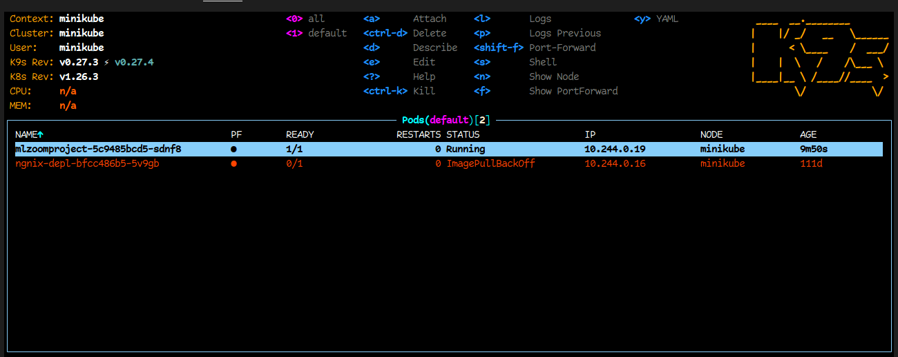
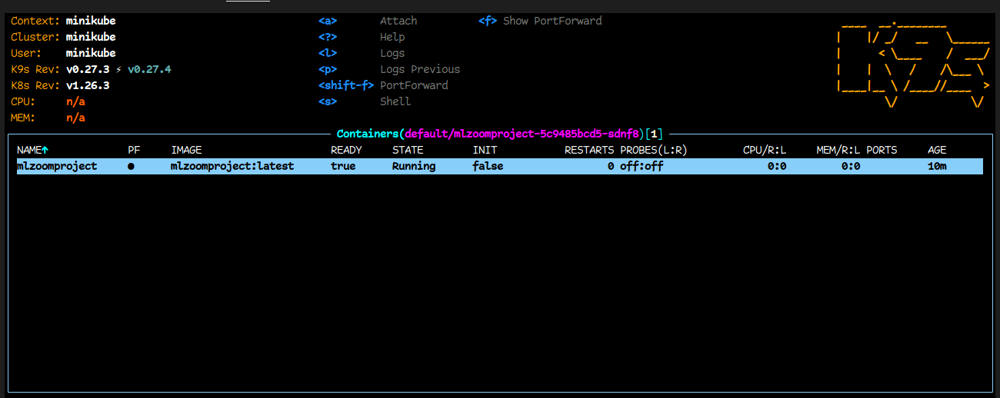
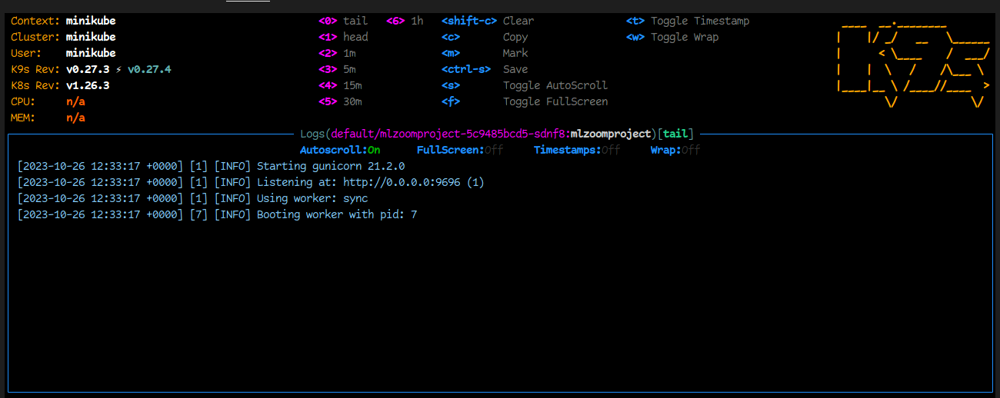
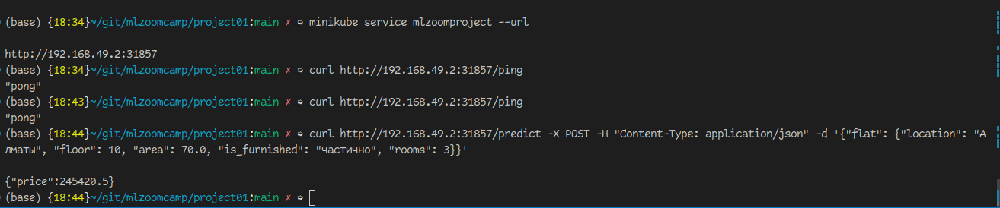

# midterm project
ML Zoomcamp 2023  
----
```
├── data               <- All the data for our project  
│   └── raw            <- The original, immutable data dump.  
│  
├── models             <- Trained and serialized models, model predictions, or model summaries  
│  
├── notebooks          <- Jupyter notebooks with EDA and model selection  
│  
├── pics               <- Some pictures for README.md  
│  
├── src                <- Source code for use in this project.  
│   ├── train.py       <- Script for training a model  
│   └── app.py         <- Flask app with our model  
│  
├── Dockerfile         <- File for building a docker container with our app  
│  
├── Makefile           <- Makefile with commands like `make install` to prepare `pipenv` and so on  
│  
├── Pipfile            <- The pipenv file for reproducing the analysis environment, e.g.  
├── Pipfile.lock  
│  
└── README.md          <- The top-level README for developers using this project.    
```
----
I'm moving to Astana this Friday. Because of this move, I wanted to learn more about the rental prices in the city. So, I decided to make a project using rental ads.

To start, I created a tool that collects rental ads from krisha.kz. This tool helped me get important details about each rental property.

After getting the data, I looked at it closely to understand trends and patterns.
  * [Dataset preparation and EDA](notebooks/eda.ipynb)
---
With the data ready, I tried different models to predict rental prices. Even though I tested many models, the simplest one, linear regression, worked the best. This might be because the data showed a strong link between the size of a property and its price.  
  * [Model selection](notebooks/modeling.ipynb)
---
After finishing the EDA, I wrote a script to train my model. This script took the data from the rental ads and used it to teach the linear regression model. (use train.py -h for help)
  * [Training script](src/train.py)
---
Next, I built a simple app using Flask. This app lets users see how my model works and get predictions for rental prices.  
  * [Flask app with my model](src/app.py)
  * To run the app you first need to check if you have `pipenv` installed, if not run:
    * `pip install pipenv`
    * then ensure that you are in the my project directory and run `pipenv --python 3`
    * after that you should run `pipenv sync` to install all dependencies needed from `Pipfile.lock`
  * Now you can run app using `pipenv run gunicorn app:app --bind 0.0.0.0:9696`
---
Finally, I packed my app into a Docker container. This makes it easy for anyone to use my app without any setup.  
  * [Dockerfile](Dockerfile)
  * If you want to run my app in container follow these steps:
    * make sure that you are in the project directory and run `docker build --no-cache -t mlzoomproject .`
    * wait till container is built and run `docker run -p 9696:9696 mlzoomproject:latest`
    * maybe you use these ports so fill free to forward it somwhere else
---
For your convinience you can use [Makefile](Makefile)  
  * `make install`          - to install pipenv and all dependencies
  * `make run-app`          - run Flask app locally
  * `make build-docker`     - build docker container
  * `make run-docker`       - run docker container with my app
  * `make ping`             - check availability
  * `make prediction`       - make prediction with model
---
Deployment. I made that part locally using `minikube`
Here is a short instruction how one can reproduce my results:
  * make sure that you have `minukube` installed then run `minikube start`
  * then you'll need to set your current terminal's Docker environment to that of Minikube's `eval $(minikube docker-env)`
  * make sure that you in my projects dir and build app container in minukube env `docker build -t mlzoomproject:latest .`
  * create simple deployment with `kubectl create deployment mlzoomproject --image=mlzoomproject:latest`
  * make sure that `imagePullPolicy: IfNotPresent` with command `kubectl edit deployment mlzoomproject`
```
spec:
containers:
- name: mlzoomproject
    image: mlzoomproject:latest
    imagePullPolicy: IfNotPresent
```
  * expose the deployment with `kubectl expose deployment mlzoomproject --type=NodePort --port=9696`
  * now you can access the application `minikube service mlzoomproject --url`
  * don't forget to stop it after all `minikube stop` and `kubectl delete deployment mlzoomproject`
Here is some pict that prove all i described above c:




